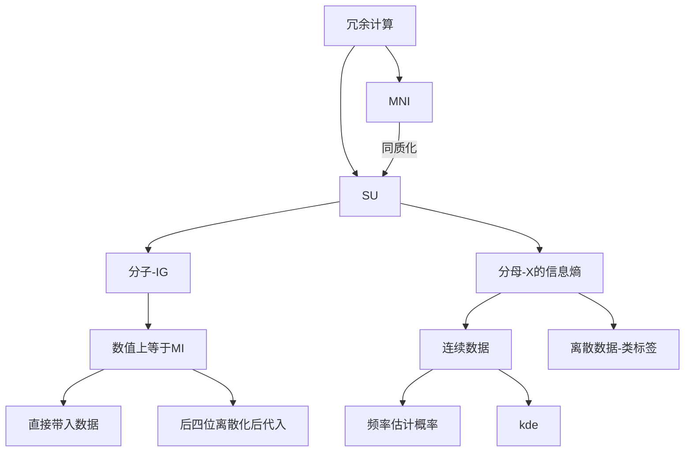

# 中期文档

## 零、改动日志

| 改动日期   | 修改人 | 修改内容                                                     |
| :--------- | ------ | ------------------------------------------------------------ |
| 2020/11/9  | 周致宽 | 对目录和正文结构进行了一定程度的整理，在一些标题后补充了说明文字，增加了部分细节 |
| 2020/11/10 | 黄悦   | 对正文公式及流程图进行了书写和排版                           |
| 2020/11/12 | 廖然   | 对正文措辞部分与部分细节的改善与补充，对2.1、2.2方法结果的分析部分进行了补充。修改了MDLP流程图。 |
|            |        |                                                              |
|            |        |                                                              |
|            |        |                                                              |
|            |        |                                                              |
|            |        |                                                              |
|            |        |                                                              |


## 一、背景摘要

  在图像处理和模式识别中，用高维特征描述图片时内容往往有特征冗余和存在噪声干扰等问题.


### 1.1 特征选择

  一个典型的机器学习任务，是通过样本的特征来预测样本所对应的值。
在实现机器学习任务中，获得数据之后通常首先进行特征选择。即“数据预处理”。
特征选择可以看作一个搜索寻优问题，即选择最优的特征子集。

  - **冗余控制** -- 特征选择的一个重要优化目标.

### 1.2 处理数据

  两部分：仪器采集的功率谱密度（绝对功率谱密度），以及用前者进行非线性变换后生成的的相对功率谱密度，两者都是连续型非负变量。本研究的起点就是为了探究生成数据相对于原始数据的冗余程度。

## 二、研究路线

### 2.1 冗余度分析方法

  ​	为了达到控制冗余的目的，我们首先需要有评估特征间冗余度的方法，2.1节主要讨论在研究中学习尝试过的方法。

#### 2.1.1 标准化互信息（NMI）


  互信息的信息论含义有多种，在此我们可理解为一种衡量相关性的指标，不同于皮尔逊系数等线性度量，互信息（包括标准化互信息）可以较好地衡量非线性相关随机变量的相关程度。NMI的取值在[0,1]之间，数值越大则随机变量的间相关程度越大。

- **定义**：
    $$
    I(X;Y) = \sum_{x\in X}\sum_{y\in Y}p(x,y)\log\frac{p(x,y)}{p(x)p(y)}
    $$

- **使用sklearn中函数计算标准化互信息代码如下**：
```python
from sklearn import metrics

if __name__ == '_main_':
    A = [1, 1, 1, 2]
    B = [2, 2, 2, 1]
    result_NMI = metrics.normalized_mutual_info_score(A, B)
    print('result_NMU', result_NMI)
```

- **输出结果**：

```
result_NMU 1.0
```

- **计算结果**：

    以四个特征为一组，呈现对角线趋于相等趋势。部分结果如下：

  |                 | alpha_relative1   | alpha_relative2   | alpha_relative3   | alpha_relative4   |
  | --------------- | ----------------- | ----------------- | ----------------- | ----------------- |
  | alpha_absolute1 | 0.980802050176177 | 0.822893046342506 | 0.819070286398944 | 0.922751086924916 |
  | alpha_absolute2 | 0.826469782389240 | 0.980552779560784 | 0.738903810878526 | 0.766926247997307 |
  | alpha_absolute3 | 0.818679683065889 | 0.737697747843010 | 0.979710947548267 | 0.816266591411456 |
  | alpha_absolute4 | 0.920107746333321 | 0.762733211827718 | 0.814690143108008 | 0.982553824417003 |
  | beta_absolute1  | 0.999608052488214 | 0.833019527353445 | 0.828023670550519 | 0.935295379042771 |
  | beta_absolute2  | 0.833111629773810 | 0.999792292311401 | 0.746969432760848 | 0.770023041704270 |
  | beta_absolute3  | 0.828104176735034 | 0.746938323601076 | 0.999660851837225 | 0.824810330633471 |
  | beta_absolute4  | 0.935323317017756 | 0.769935771492425 | 0.824735512868742 | 0.999600390029895 |

  具体结果见：NMI.xlsx

  

- **分析**：

1. NMI是社区发现(community detection)在有标准ground-truth的情况下的重要衡量指标，基本可以比较客观地评价出一个社区划分与标准划分之间相比的准确度。

2. 但NMI对连续变量并不适用，理由是经典信息论的一系列公式都是针对离散化变量提出的，其计算结果在连续数据上会出现不同程度的失真，在取值较多的的数据集上尤其明显。

3. 对于连续数据，有推导公式  ：
   $$
   I(X;Y) = \int_{X}\int_{Y}p(x,y)log\frac{p(x,y)}{p(x)p(y)}dxdy
   $$
   的存在，但此推导至今并无严格的数学证明，且积分的计算在实际应用层面难以实现，故直接运用互信息计算存在困难。

3. 关于特征间互信息大小和冗余度存在相关性，这一点得到了广泛认可。但对于“特征是否冗余”这个问题，并没有一个普适的评判标准。在面对不同问题时会根据经验或数据类型人为制定标准，由于NMI并不是本项目直接采用的方法，在此不做展开。


####  2.1.2对称不确定性（SU）

  SU和标准化互信息的计算推导到最后是十分相似的，但计算过程和一些细节处有所不同，且是我们最终采用的方法，故在此区分。

参考论文：
> *《基于对称不确定性和SVM递归特征消除的信息基因选择方法》*
>
> > *叶明全，高凌云，伍长荣，万春园*


- **定义**：

  给定2个随机变量 X 和 Y，X和Y的对称不确定性表示为：
$$
SU(X,Y) = 2[\frac{IG(X|Y)}{H(X)+H(Y)}]
$$


> H(x) -- 信息熵；H(X|Y) -- 条件熵；IG（X|Y）= H(X) - H(X|Y) -- 信息增益

同样，SU取值在[0,1]区间内，数值越大则随机变量的相关性越强

- **冗余判断标准**

  用C表示分类标签，若要判断一对特征 $F_i,F_j$是否存在冗余，则考虑SU(F<sub>i</sub>, C), SU(F<sub>j</sub>, C), SU(F<sub>i</sub>, F<sub>j</sub>)的大小关系，当：
$$
SU_w(F_i,C)≥SU_w(F_j,C) 且 SU_w(F_i,F_j)≥SU_w(F_j,C)时
$$
可以理解为，当F<sub>i</sub>比F<sub>j</sub>与标签有更强相关性且F<sub>i</sub>与F<sub>j</sub>(相对)高度相关时，F<sub>j</sub>被认为冗余。


- **分析**

1. 此处的冗余判断标准为参考论文中所提出，并非学术界共识。但由实验结果表明, 对称不确定性方法能够用较少的信息基因获得更高的分类精度, 从而既能改善算法的泛化性能, 又能提高时间效率。
2. SU的分子信息增益，在数值上其实和互信息是相同的，实际上这两者是对一个数值从两个角度做的解读。
3. 为了做到定义上的严谨，将SU和NMI区分开。而SU和NMI的计算流程实际上是不同的。我们的计算方法则是在前者的基础上展开研究。


----

### 2.2 连续数据处理方法

计算的对象是对称不确定度SU，计算公式：
$$
SU(X,Y) = 2[\frac{IG(X|Y)}{H(X)+H(Y)}]
$$

#### 2.2.1 直接带入计算（尝试）

  即，将连续数据直接看作离散数据，带入针对离散变量定义的信息熵公式$H(x) = \sum_{i}P(x_i)log_2P(x_i)$进行计算，用频率估计概率。信息增益则使用互信息进行计算，数据直接代入: $ IG(X|Y) = MI(X, Y)$

- **在数据集上得到的结果**：

（没找到> <,  全看记忆 P31）

(好像找不到得重新算)


- **分析：**

  ​    结果有一定规律性，但数值上置信度并不高（出现了过大的SU值）。用频率估计概率P(x)的方法在处理离散变量时，有大数定律支撑，然而此处的情景并不适用。考虑用其他方法估计P(x)和P(x|y)。


#### 2.2.2 离散化处理

经典信息论的公式是针对离散型随机变量提出，则将连续型变量转化成离散型变量再代入计算，即数据离散化。离散化是复杂的，追求最优的离散化更是一个np难问题，本文采用的离散化方法并未被证明为最优，仅采用了当下认可度较高的一种方法。

- ##### 计算流程：

  1.  将连续数据使用离散方法进行离散化。

  2. 分子信息增益代入互信息公式进行计算 $ IG(X|Y) = MI(X, Y)$。
  3. 分母信息熵则可直接依照香农的公式进行计算$H(x) = \sum_{i}P(x_i)log_2P(x_i)$。

- #####   离散化方法：MDLP

  一种基于熵的离散化方法，并利用了标签信息。

  **MDLP算法**：

  ```mermaid
  graph TD
  A[计算信息熵ent] -->B[计算切点及切分后信息熵cutIndex]
     B --> |据切分后信息熵|G[制定停止切分条件] 
     B --> C{切分要求}
     G --> C
     C -->|是| D[返回切点列表]
     C -->|否| E[循环]
     E --> A
  ```

  ​       代码见：useful.py

- **在数据集上得到结果**：

      对于大多数相对功率谱20个特征，除绝对功率谱的3，7，11，14，15个特征外，其相对与剩余绝对功率的特征均冗余。

    具体结果见：lisan1.xlsx

    

- **分析**

  程序运行结果存在以下情况：

  1. 在人工决定的阈值，数值离散化程度实际上有部分先验因素影响，从目前选定的阈值来看，离散化程度并不高，但应该如何调整仍待讨论。
2. 递归层数较深，在部分特征值上的离散化无法得出运行结果。
  3.  由上述分析，因此在本次运算中对无法使用MDLP得出结果的几列特征采取保留小数位的方法进行离散化。

- **关于离散化方法的讨论**

  1. 由于信息熵和互信息的定义，其数值大小对离散化程度敏感，离散化的方法对离散熵数值的影响是显著的。

  2. 基于上一点中提到的性质，想要用离散熵验证kde熵的想法无法通过直接比较熵的数值大小来实现。

  3. 现阶段的想法是直接比较MDLP离散化方法计算的SU与kde方法计算的SU，但是由于无法得出MDLP切分的完整结果的问题（分析中提及）。接下来考虑简单的等宽离散等方法，或者进一步完善MDLP的编写。

     
  

#### 2.2.3 核密度估计（KDE）

核密度估计是一种是用于估计概率密度函数的非参数方法，相关原理和内容较为复杂，本文只简单介绍原理，重点在于应用。


思路：通过核函数将每个数据点的数据+带宽当作核函数的参数，得到N个核函数，再线性叠加就形成了核密度的估计函数，归一化后就是概率密度函数了。


- **公式**：
  $$
  \begin{aligned}
  \hat{f}_h(x) &= \frac{1}{n}\sum_{i=1}^nK_h(x-x_i)\\ 
  &= \frac{1}{nh}\sum_{i=1}^nK(\frac{x-x_i}{h})
  \end{aligned}
  $$
  

>f为概率密度函数
>
>>K（.）为核函数 


- **具体代码**：

```python
  from sklearn.neighbors import kde
  def h1decision(b):
      """
      计算带宽
      参数：
          b {ndarray}  一维数组
      返回值：
          res {int}   这组数据带宽
      """
      # 这里使用样本标准差
      a1 = np.std(b,ddof=1)
      l = len(b)
      tmp = math.pow(l,-0.2)
      res = 1.05*a1*tmp
      return res 
  nyse2 = pd.read_excel('ab.xlsx', usecols=[1])
  b = use.dTl(nyse2)  # df-->ndarray
  b1 = nyse2.values  # 二维数组
  h3 = use.h1decision(b)  # 带宽
  
  logpy = kde.KernelDensity(kernel='gaussian', bandwidth=h3).fit(b1).score_samples(b1)
```


参数解释
>a.score_samples(X)
>
>>返回的是点x对应概率的log值(计算模型下的总log概率)，要使用exp求指数还原


>带宽选择 h = c * N^(-1/5)
>
>> 对正态分布 c = 1.05 * 标准差，作为参考值

----

##### - 前期探索：原公式计算

​	由于kde的应用并不广泛，用其解决问题的实例也较少，开始学习时有过不少尝试，也包括一些错误，也在此做一些记录

- **使用kde计算SU的方法**：一开始的想法是使用kde估计密度概率，用于计算连续熵H(X) ，分子由于积分困难暂且保留之前计算信息增益的方法。整体上保留了SU定义式的计算流程。


- **归一化：**一开始的理解中，连续熵所需要的p(x)是概率函数，故我们认为kde返回的数值为概率值（一定程度上也受了一些错误博客内容的误导），而实际代码运行的结果有的已经超过了1。为了保证得出P(X)的取值在(0~1)内，对kde估计的结果进行了归一化。

代码如下:

    def minmax(X):
        """
        最大最小值标准化【0，1】
        :param X: 需要标准化的二维数组ndarray
        :return: res :标准化后的一维数组ndarray
        """
        x = X.reshape(len(X), 1)
        min_max_scale = preprocessing.MinMaxScaler(feature_range=(0.00000000001, 1))
        tmp = min_max_scale.fit_transform(x)
        res = tmp.flatten()
        return res


​     

-  **计算结果**

1. 分子依旧采用互信息（保留小数点后4位）方式计算。
2. 分母熵使用kde进行计算后，最后标准化熵值。



*问题*

1. 分子分母不一致处理，合理性待讨论。
2. 实际所用kde估计熵为，将kde所求的概率密度函数直接当作概率计算熵，事后查阅文档发现是错误的。

----

##### - 改进：基于KDE的改进公式

后续的研究中，发现有人尝试过根据kde方法推导连续熵的近似计算（区别于香农提出的公式），在尝试运用的途中也遇到了一系列困难，我们也进行了相应的尝试去解决问题。

参考论文：

> *《混合数据的核密度估计熵与快速的贪心特征选择算法》*
>
> > *张靖红*

根据连续随机变量的实例概率
$$
\int_{x\in X}\hat{p}(x)dx=\frac{1}{n}
$$
，推导了如下公式：

- KDE熵公式：
  $$
  \begin{aligned}
  \hat{H}(\boldsymbol{X}) &= -\int_{\boldsymbol{x}\in \boldsymbol{X}}\hat{p}(\boldsymbol{x})d\boldsymbol{x}\\
   &= -\frac{1}{n}\sum_{k=1}^n\log\hat{p}(\boldsymbol{x}_k)
  \end{aligned}
  $$


- KDE条件熵公式：
  $$
  \begin{aligned}
  \hat{H}(D|\boldsymbol{X}) &= \int_{\boldsymbol{x}\in \boldsymbol{X}}\hat{p}(\boldsymbol{x})\hat{X}(D|\boldsymbol{X}=\boldsymbol{x})d\boldsymbol{x}\\
  &= -\int_{\boldsymbol{x}\in \boldsymbol{X}}\hat{p}(\boldsymbol{x})\sum_{d\in D}\hat{p}(d|\boldsymbol{x})\log\hat{p}(d|\boldsymbol{x})d(\boldsymbol{x})\\
  &= -\frac{1}{n}\sum_{k=1}^n\sum_{d\in D}\hat{p}(d|\boldsymbol{x_k})\log\hat{p}(d|\boldsymbol{x_k})
  \end{aligned}
  $$

- 分析：

1. 论文给出的D为标签变量，即只给出了特征对于标签的信息增益计算方法，而特征之间的信息增益计算方法未涉及,此外，条件概率的kde计算方法同样是针对特征和标签间的。（区别：标签是严格的离散变量，而我们计算的特征是连续变量）

2. 关于上述提到会导致的问题：如果直接将条件概率公式运用到特征间条件熵计算：

$$
p(c|x)=\frac{\sum_{i\in I_{c}}\phi(x-x_i,h)}{\sum_{k=1}^{N}\sum_{i\in I_{k}}\phi(x-x_i,h)}
$$
  ​由于其计算方法本身的特点,我们需要对特征x按特征c的取值进行划分，分别对每一个划分段进行核密度估计，这样的划分对于取值数达到十万级别的连续型数据是不能接受的，同组内过小的数据量也会让kde方法失去意义。

3. 对于第一点中的问题，我们尝试了两方面的解决方法：a.推导适用于连续特征间条件熵计算的公式 b.计算时，将对应标签特征的特征值离散化处理，这些处理方法又导致了新的问题，我们会对这两个方法做后续讨论。

   

- 疑问：

1. 连续随机变量的实例概率
$$
\int_{x\in X}\hat{p}(x)dx=\frac{1}{n}
$$
  这个公式是张[]的论文里根据Nojun Kwak[]里关于kde条件概率公式直接推导（甚至只能算是类比）出的，并没有经过严格的证明，合理性尚且存疑，且后续的一些实验结果表明这个推导（或者近似计算）似乎并不正确。

2. 如果上述kde熵计算公式被确认不可靠，那么我们关于信息熵的计算方法似乎只剩下离散化一条路可选，这一点需要格外关注。

----

为了解决以上提出的部分问题，我们做了以下尝试：

###### 尝试1.KDE条件熵推导

尝试得出适用于特征间条件熵计算的公式，进行了两个推导：

- 1:

$$
\begin{aligned}
&\int_Y\int_Xp(x,y)log(\frac{p(x,y)}{p(x)p(y)})dxdy\\
&= \frac{1}{n}\int_{Y}\sum_{k=1}^np(y|x_k)\log(\frac{p(x_k,y)}{p(x_k)p(y)})dy\\
&= \frac{1}{n}\int_{Y}\sum_{k=1}^n\frac{p(y)(p(x_ky))}{p(x_k)}\log(\frac{p(x_k,y)}{p(x_k)p(y)})dy\\
&= \frac{1}{n}\int_{Y}p(y)\sum_{k=1}^n\frac{p(x_k|y))}{p(x_k)}\log(\frac{p(x_k,y)}{p(x_k)p(y)})dy\\
&= \frac{1}{n}\int_{Y}p(y)\sum_{k=1}^n(\frac{p(x_k|y)}{p(x_k)})\log(\frac{p(x_k,y)}{p(x_k)p(y)})dy\\
&= \frac{1}{n^2}\sum_{k=1}^n\sum_{l=1}^n\frac{p(x_k|y_l)}{p(x_k)}\log\frac{p(x_k,y_l)}{p(x_k)p(y_l)}
\end{aligned}
$$


- 2:

  实例概率：
  $$
  \int_{x\in X}\int_{y\in Y}p(x,y)dxdy = \frac{1}{n^2}\\
  \begin{aligned}
  I(x,y) &= \int_{x\in X}\int_{Y\in Y}p(x,y)\log\frac{p(x,y)}{p(x)p(y)}dxdy\\
  &= \sum_{i=1}^n\sum_{j=1}^n\log\frac{p(x_i,y_j)}{p(x_i)p(y_j)}
  \end{aligned}
  $$
  
- 3:
  **尝试的条件熵推导结果：**
  $$
  \begin{aligned}
  H(Y|X)
  &= \int_{x\in X}P(x)H(Y|X=x)dx\\
  &= -\int_{x\in X}P(x)\int_{y\in Y}p(y|x)logP(y|x)dx\\
  &= -\frac{1}{n}\sum_{k=1}{n}\int_{y\in Y}P(y|x_k)logP(y|x_k)dy\\
  &= -\frac{1}{n}\sum_{k=1}^n\int_{y\in Y}P(y|x_k)logP(y|x_k)dy\\
  &= -\frac{1}{n}\sum_{k=1}^n[\sum_{j=1}^\frac{m_k}{}\frac{1}{m_k}logP(y_i|x_k)]
  \end{aligned}
  $$
  

实验结果：得出的条件熵并不符合期望（应该是一个比单变量信息熵要小的数值），问题可能出在信息熵，或条件熵上。

----

###### 尝试2.部分离散化

顾名思义，在计算条件熵p(y|x)时，当作计算p(c|x)处理，即把特征y离散化作为标签处理：

实验结果：目前与熵值的大小关系符合定义，能够得出合法的SU数值，但正确性仍待考量

- 分析：

1. 依照尽量减少信息损失的原则，这样的混用方法似乎可以理解，但是从理论上证明其合理性相当困难

2. 一旦用到离散化，则需要考虑离散化方法问题，理由仍然是熵对离散化程度的敏感性

3. 关于离散化程度的考量：正如之前提到过的，最优离散化方法是一个np难问题，故去寻找一个最佳答案并不明智。目前的想法是，将条件概率的数值控制在其有意义的区间内，即可接受。理由是我们最后并不会直接把计算出的SU数值用作特征选择，而是用到其大小关系，这一点其实基本不会收到离散化程度的影响。
